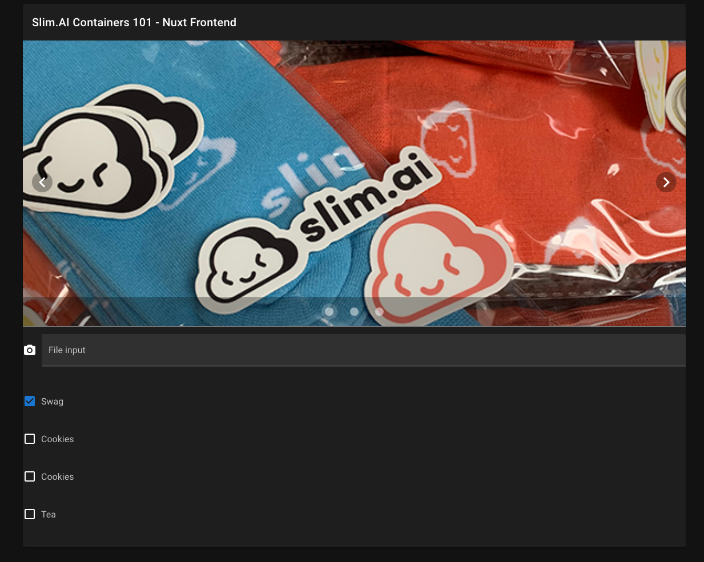

# Containers 101 - Networking Part 3: Connecting Frontend and Backend

# Introduction


In our past two seesions, we've built a Docker Compose file for our monolithic photo app, and then created a containerized version of the front-end using VueJS, Nuxt, and Vuetify.

Now, it's time to hook the two services together!

### The Plan:
1. Update the frontend to handle ajax-y calls to backend to send and receive data
2. Update the backend to act as an API, not a full-service app
3. Expand the Docker Compose file to create a network out of the frontend and backend containers.

# Backend updates
We need to make the following updates to our Python Flask app so it works more like a backend.

First, we add an endpoint to get all of our images:

```python
@app.route('/images/', methods=['GET'])
def images():
    """Endpoint to list images on the server."""
    files = []
    for file in os.listdir(UPLOAD_FOLDER):
        filepath = os.path.join(UPLOAD_FOLDER, file)
        if os.path.isfile(filepath) and allowed_file(filepath):
            files.append(f"image/{escape(file)}")
    message = jsonify(images=files)
    return make_response(message, 200)
```

Next, we add an endpoint to serve a single image:

```python
@app.route('/image/<image>', methods=['GET'])
def get_image(image):
    """Endpoint to return an image from the server."""
    filename = os.path.join(UPLOAD_FOLDER, f"{escape(image)}")
    return send_file(filename)
```

For browser-y reasons that we'll discuss later, we use Flask-CORS to get us through any cross-origin issues, but we should remove it for production.


# Frontend updates
We need to add some javascript-y bits to our `<script>` section in the `Carousel.vue` app.

```javascript
<script>
import axios from 'axios';

export default {
  data () {
    return {
      items: [{
        src: "http://0.0.0.0:5000/image/Tea3.png"
      }],
      doneGettingItems: false,
    }
  },
  methods: {
    getImages() {
      const apipath = 'http://0.0.0.0:5000/images/';
      console.log(this.items);
      axios.get(apipath)
        .then((res) => {
            console.log(res);
            const imgpath = 'http://0.0.0.0:5000/';

            for (let i = 0; i < res.data.images.length; i++) {
              this.items.push( {src: imgpath + res.data.images[i] });
            }
            this.doneGettingItems = true;
        })
        .catch((error) => {
            this.doneGettingItems = true;
      })
    }
  },
  created () {
    this.getImages();
    console.log("Got new images from backend.");
    console.log(this.items);
  }
}
</script>
```

# Docker Compose Changes

```yaml
services:
    backend:
        build: backend/.
        #image: slimpsv/pyphotoapp:latest
        ports:
        - "5000:5000"
        volumes:
        - ~/Documents/Projects/slim-cotw/containers101-networking-2/srv/photo/images:/app/static/images # should map to S3 bucket or similar
        - ~/Documents/Projects/slim-cotw/containers101-networking-2/srv/photo/data:/app/data # will remove when DB service available

    frontend:
        build: frontend/.
        #image: slimpsv/nuxt-fe:latest
        ports:
        - "3000:3000"
        links:
        - backend
```

And we run with:

```bash
$ docker compose up -d --build
```

Stop with:

```bash
docker-compose down
```
