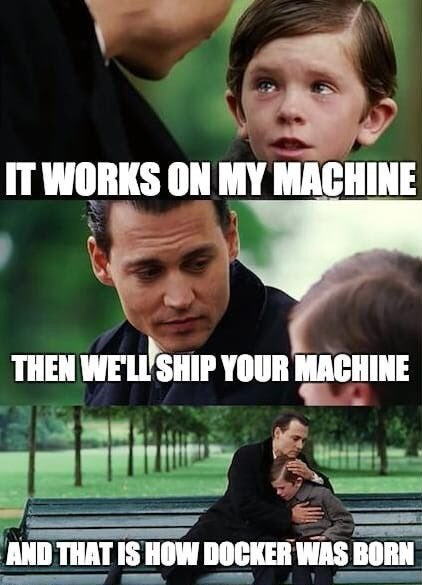

# Containers 101

# Introduction 
Here by popular request! This tutorial is meant for viewers of the [SlimDevOps Twitch Stream](https://www.twitch.tv/slimdevops). Several of our community members expressed an interest in this "Square One" overview of all things containers, along with a hands-on "bring your own app" live coding workshop. 

This tutorial seeks to help developers understand container technology, know the major tools required to create and manage containers, and () 

In this tutorial, we will cover:
- What is a container and why would I use one? 
- Basic Docker commands 
- Creating a container for your application 
- Making your Dockerfile ready for production
- Pushing the image to Docker Hub 

Out of scope for this tutorial, but potentially coming soon: 
- Slimming your container 
- Multi-container applications with Docker Compose
- Mounting local volumes from a container 
- Shipping and testing containers via CI/CD
- Anything to do with Kubernetes 😉
- Advanced container techniques (buildpacks, multistage builds, etc.)

## Set-up 
- Be on the internet (for pulling and pushing images)
- [Install Docker Desktop](https://docs.docker.com/get-docker/)
- Option 1: [Open a GitPod instance](LINK TO OUR REPO ON GITPOD)
- Option 2: [Clone this repo into your local IDE](LINK TO REPO)

# What is a conatiner? 
A container is a piece of software that 

| A container is like a... | Kind of | Not quite | 
| ---------- | --------- | ------- |
| Virtual Machine | It is a self-contained environment | It doesn't have a Guest OS layer like a VM | 
| Development Environment | Libraries and dependencies are unique to the container | It is designed to be shipped along with the app |  
| Independent OS | The container has its own filesystem | It still runs on the local host and can access the local OS | 

## When we say 'container' do we mean 'Docker'? 
Docker is the most popular container daemon, management software, and container repositroy (Docker Hub) among developers today. Docker's ease of use and great tooling paved the way for the wide adoption of containers and it remains the way most developers interact with containers in the modern eco-system. 

However, Docker isn't the ONLY option for working with containers. Projects such as the CNCF's [ContainerD](https://containerd.io/) and the [Open Container Initiative](https://opencontainers.org/) are starting to gain wider adoption, there has been a large proliferation in [container registry options](https://www.slim.ai/blog/understanding-container-registries-public-vs.private-container-images.html) in recent years.  

# Why use containers? 
The primary benefits of using containers is to reduce the overhead and unpredictability that comes from developing software at scale, that is to say solving the classic: "It worked on my machine" conundrum. Containers allow you to explicitly

## What are some of the drawbacks to using containers? 
While the adoption of containers is growing steadily in organizations -- alongside related and equally as stratospheric Kubernetes and microservice architectures -- it is still relatively early days for containers and there are several challenges developers face in adopting containers. Such as: 

- **Learning curve / specialization:** 
- **Knowledge of best practices:** 
- **Staying current with updates and security patches:** Managing containers across even a modest size team can turn into a job itself. Many large organizations now have dedicated DevX teams who are at least partially responsible for curating and maintaining container images. Updating images can be either labor intensive (when done manually) or opaque (when done automatically), leading to break-fix cycles that frustrate devs.  

# Basic Terminology
- **Docker daemon**: The Docker program running on the local host that makes Docker possible
- **Container Image**: This is a set of files and instructions that allow you to `docker run` a container, creating a single instance of a Container instance
- **Container**: This is a single unit created from a Container image. It is ephemeral and will be completely destroyed when removed

## Common Docker Commands
| command | use | example | flags | 
| ------- | --- | ------- | ---- | 
| docker pull | pull public image to local machine (from Docker Hub, unless otherwise specified) | docker pull ubuntu:latest | |
| docker build | build image from the Dockerfile localed in current dir | `docker build --name me/myimage .`| |
| docker images | get list of local images | `docker images \| grep ubuntu` | | 
| docker run | create single container from container image | `docker run --name mycontainer -it ubuntu:latest` /bin/bash | -d (run as daemon) -it (interactive mode) -p (specify port) --name (name container, otherwise randomly generated) |   
| docker ps | list current running images | `docker ps` | | 
| docker rm | remove container | `docker rm mycontainer` | |  
| docker rmi | remove container image (see also `prune`) | `docker rmi myimage` | -f (force) | 

# Your application 
*Martin* 

# Tutorial
## 1. Warm-up: Ubuntu app
Pull latest Ubuntu image. 

`docker pull ubuntu:latest`

Shell into the image to take a look around. 

`docker run -it ubuntu:latest /bin/bash`

You can play around. Note: Anything you do in this shell is adding information to that ONE container, NOT the image and NOT your local system. 

`apt-get update && apt-get install 

## 1. Getting Started 
Directory setup 
*Martin*

Install dependencies 
*Martin* 

## 2. Finding a base image
Find a base image - we'll use Ubuntu 

Exploration: Build and run base image 

## 3. Creating a Dockerfile 
- FROM 
- RUN apt-get updates
- COPY / ADD dependencies and app files 
- ENTRYPOINT 

## 4. Build your image  
### And test it 

## 5. Container Best Practices - Dockerfile improvements
- Don't use latest 
- Install security updates
- Don't run as root
- Optimize build dependencies
- Pick the best ENTRYPOINT or CMD 

## 5. Push to Docker Hub 

# Resources 
- [Docker and DevOps - Bret Fisher](https://www.youtube.com/BretFisherDockerandDevOps)
- [Docker for Web Developers - Coding with Dan]([https://www.pluralsight.com/courses/docker-web-development)
- [How to Get Started with Docker - Docker's Peter McKee](https://docs.docker.com/get-started/)
- [Docker for Developers - Andy Dennis & Richard Bullington McGuire](https://www.packtpub.com/product/docker-for-developers/9781789536058)
- 