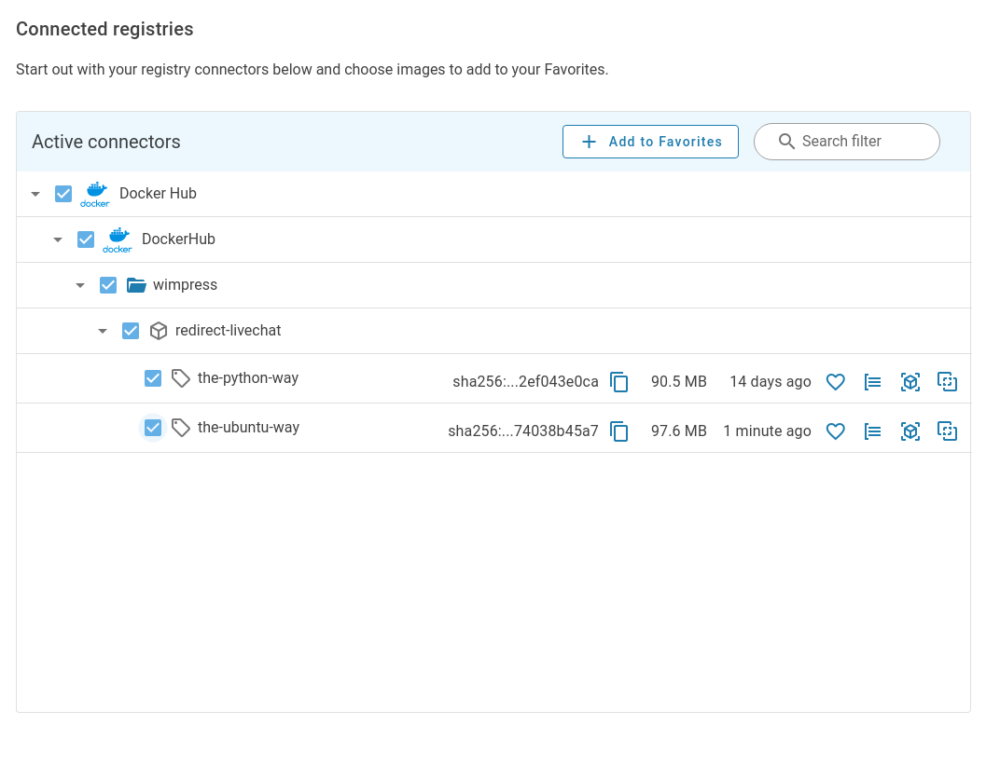

# Containers 101 - Exploring and Comparing container images

# Introduction

This tutorial is meant for viewers of the [SlimDevOps Twitch Stream](https://www.twitch.tv/slimdevops)
and builds on the [Containers 101 Beginners Workshop](../containers101-beginners-workshop/README.md)
and [Containers 101 Production Ready Workshop](../containers101-prod-ready/README.md)
by showing how to explore and compare container images with the Slim Developer Platform

In this tutorial, we will cover:
- Publishing a container image to DockerHub
- Connecting DockerHub to Slim Developer Platform
- Exploring container images
- Comparing (diff'ing) container images using the Slim Developer Platform

## Set-up
- Be on the internet (for pulling and pushing images)
- [Install Docker Desktop](https://docs.docker.com/get-docker/)

### Docker

```
sudo apt -y install apt-transport-https ca-certificates curl gnupg lsb-release
curl -fsSL https://download.docker.com/linux/ubuntu/gpg | gpg --dearmor -o /usr/share/keyrings/docker-archive-keyring.gpg
echo "deb [arch=amd64 signed-by=/usr/share/keyrings/docker-archive-keyring.gpg] https://download.docker.com/linux/ubuntu $(lsb_release -cs) stable" | sudo tee /etc/apt/sources.list.d/docker.list
apt -y update
apt -y install docker-ce docker-ce-cli containerd.io
docker run hello-world
sudo groupadd docker
sudo usermod -aG docker $USER
```

### DockerSlim

See the [DockerSlim INSTALLATION](https://github.com/docker-slim/docker-slim#installation)
for all platform install instructions.

```
curl -L -o ds.tar.gz https://downloads.dockerslim.com/releases/1.36.4/dist_linux.tar.gz
tar -xvf ds.tar.gz
mv  dist_linux/docker-slim /usr/local/bin/
mv  dist_linux/docker-slim-sensor /usr/local/bin/
```

### Workshop

- [Clone this repo into your local IDE](https://github.com/slimdevops/slim-containers)

```
git clone https://github.com/slimdevops/slim-containers
```

# Example application

Martin has a simple Python application we can use as an example:

  * https://github.com/wimpysworld/redirect-livechat

Clone the project and switch to `the-ubuntu-way` branch.

```bash
git clone https://github.com/wimpysworld/redirect-livechat
git checkout the-ubuntu-way
```

## Build the-ubuntu-way image

```Bash
docker build -t redirect-livechat:the-ubuntu-way .
docker images
```

## Push to Docker Hub

```
docker login -u YOUR_DOCKERHUB_NAME
docker tag redirect-livechat:the-ubuntu-way YOUR_DOCKERHUB_NAME/redirect-livechat:the-ubuntu-way
docker push YOUR_DOCKERHUB_NAME/redirect-livechat:the-ubuntu-way
```

## Build the prod-ready image

```Bash
git checkout prod-ready
docker build -t redirect-livechat:prod-ready .
docker images
```

## Push to Docker Hub

```
docker tag redirect-livechat:prod-ready YOUR_DOCKERHUB_NAME/redirect-livechat:prod-ready
docker push YOUR_DOCKERHUB_NAME/redirect-livechat:prod-ready
```

# Add Favourite to Slim Developer Platform

  * https://portal.slim.dev/registriesexplorer




# Explore a container images


# Compare (diff) container images


# Resources
- [Docker and DevOps - Bret Fisher](https://www.youtube.com/BretFisherDockerandDevOps)
- [Docker for Web Developers - Coding with Dan]([https://www.pluralsight.com/courses/docker-web-development)
- [How to Get Started with Docker - Docker's Peter McKee](https://docs.docker.com/get-started/)
- [Docker for Developers - Andy Dennis & Richard Bullington McGuire](https://www.packtpub.com/product/docker-for-developers/9781789536058)
