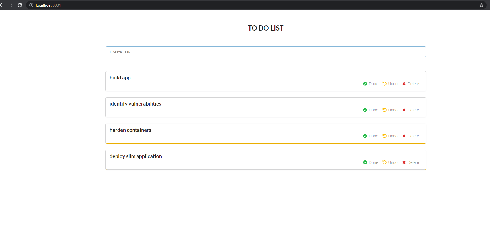

# Slimming a Full Stack: Mongo, Golang, React

---
## Introduction :wave:
Today, we are going to be slimming all four containers used in a Go-To-Do-List app. The original app code can be found [here](https://github.com/abdennour/cloudnative-implementation), with a modified version and slimming instructions available in this repository.

## App Setup

To run this app on your own machine, you should start by cloning the repository in an environment that is running the docker daemon, navigating to the app folder, and exporting the environmental variables.

```bash
cp .env.example .env
export $(cat .env| xargs)
```

You can then use docker-compose up to start the app. The -f flag can be used to specify either the regular docker-compose.yaml, which will build the original containers, or docker-compose-slim.yaml which will use the slimmed containers pulled from Dockerhub.

Once the build finishes, simply navigate to localhost:8080 to see the app.

## App Overview



First, let’s walk through our unhardened app.

Our app uses a React Frontend, with the container built from the Dockerfile in the /client folder. The Docker compose sets up the service using this configuration.

```yaml
frontend:
    build:
      context: client/
      target: release
    depends_on:
      - frontend-sidecar-env-gen
    ports:
    - 8081:8080
    env_file:
    - .env
    volumes:
    - env-js:/opt/app/config:ro
    image: abdennour/go-to-do-frontend:rc
```
The frontend relies on another container which we will be slimming: the frontend sidecar. This is a small 5mb container image which is used to implement a Singleton pattern, feeding important environmental variables to the other containers.

Our app’s API uses a Golang container, which we also build from a Dockerfile in the app folder.
```yaml
api: 
  build: 
    context: server/ 
    target: release 
  depends_on: - db 
  ports: - 8080:8080 
  environment: 
    DB_CONNECTION: mongodb://${DB_USER}:${DB_PASS}@${DB_HOST}:27017/${DB_NAME} 
    DB_NAME: ${DB_NAME} 
image: abdennour/go-to-do-api:rc
```

Finally, our largest container is the Bitnami MongoDB backend, weighing in at nearly 500 MB. It includes volumes which allow for persistent data for when you reinitialize the container.

```yaml
db: 
  image: bitnami/mongodb:${DB_IMAGE_TAG} 
  volumes: 
    - db-data:/bitnami/mongodb 
  environment: 
    MONGODB_ROOT_PASSWORD: ${DB_ROOT_PASS} 
    MONGODB_DATABASE: ${DB_NAME} 
    MONGODB_USERNAME: ${DB_USER} 
    MONGODB_PASSWORD: ${DB_PASS}
```
## Container Analysis

Let’s take a dive into what is inside these containers. Using the Slim SaaS platform, we can generate multi-scanner vulnerability reports for each of these containers, view container meta-data, and gather other important insights. Here is a quick table summarizing our findings

|container|size|packages|vulnerabilities|
|----- | ----- | ---- | ---- | 
|frontend|37.6 MB|6|50|
|sidecar|5.6 MB|14|71|
|go|34.9 MB|18|30|
|mongo|497 MB|120|290|
|total|575.1 MB|158|441|

As we can see, the first 3 containers in our stack are relatively slim already, sitting at under 40 MB each. Despite this, scans have detected 38 vulnerabilities, so another round of hardening could be beneficial.

The Mongo container weighs nearly 500 MB and boasts nearly 300 vulnerabilities, so hardening this one is also worthwhile.

## Slim it!

We can slim these container images one by one using the Slim.AI platform and applying the necessary settings. The slim platform will create a temporary container and monitor its activity, and then output a new container image with only the essential components. An important thing to note is that since the slim cloud doesn’t have access to local volumes, we should provide a different docker compose that does not ask for them. See the modified version named docker-compose-dev.yaml in our app folder..

Some extra settings are needed to harden our more complex Go and Mongo containers. Neither need an http-probe, so that should be disabled first. The Go container should be manually set to include the /docker-entrypoint-init-db.d/ file, and the Mongo container needs an exec file to know what commands to execute to mimic the app being used.

## Results

After running our containers through the slimming process, let’s see what our new stack looks like.

[API]( https://hub.docker.com/repository/docker/scicchino/go-to-do-api-slim)

[Frontend](https://hub.docker.com/repository/docker/scicchino/go-to-do-frontend-slim)

[Frontend Sidecar](https://hub.docker.com/repository/docker/scicchino/env-to-js-sidecar-slim)

[Database](https://hub.docker.com/repository/docker/scicchino/go-mongo-slim)

Using grype vulnerability scans, we can see huge improvements in the total stack.

Vulnerabilities: 441 -> 2, nearly a 100% improvement!

Packages: 158 -> 26, an 83% reduction!

Size: 575 MB -> 296 MB, bringing our final size to nearly one half the original!
