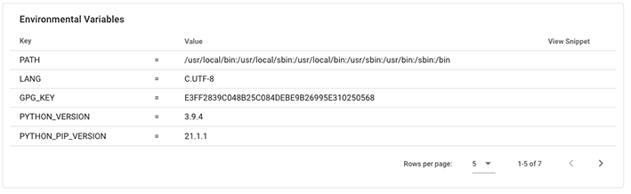
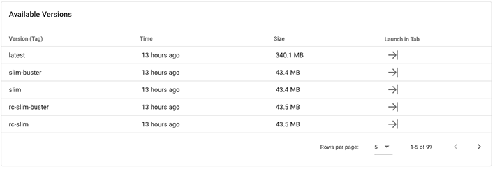

# Container of the Week: Python-Flask

- [Intro](#introduction-to-the-python-flask-container-wave)
- [About the container](#about-the-container-thinking)
- [Our Sample App](#our-sample-app)
- [Slimming the Image](#slimming-the-image-mechanical_arm)
- [Results](#results-raised_hands)

---
## Introduction to the Python-Flask Container :wave:

Today, we are going to be slimming a simple app housed in a container we built from the base Python 3.X image and leverageing Flask, one of the most common web microframeworks available. We build a basic sample app that merely takes a request url and returns a basic JSON response. This is a common pattern for building RESTful APIs and putting them in a container for repeatability and scalability. 

Like REST APIs, Flask is starting to lose some favor to more recent API approaches leveraging GraphQL, but make no mistake, REST and Flask aren't going anywhere so long as JSON data remains a valuable interchange. Flask is also so quick and easy to set up, it makes for a great prototyping tool, or can even be used for lightweight web applications. Other frameworks -- notably Django (for Python enthusiasts) or Node.JS (for Javascripters) -- are considered more robust for full-scale development, though Flask proponents will hotly debate this.  

### TL;DR: 
In this example, our basic Flask REST API application using the Python official image weighs in at **895 MB** and contains **323 vulnerabilities** (according to security scan experts at [Snyk.io](https://www.snyk.io)), including 27 high-severity issues. Our slimmed container provides the same REST app, but is just **48 MB** and has **ZERO** vulnerabilities .

#### Results Summary :chart_with_upwards_trend:
| Test | Original Image | Slim Image | Improvement | 
|----- | ----- | ---- | ---- | 
| Size | 895 MB | 48 MB | 18.7X |
| Total vulernabilities (using Snyk.io) | 323 | 0 | inf | 
| High-severity vulernabilities (using Snyk.io) | 27 | 0 | inf | 
| Time to Push to Docker Hub | 8m18s | 0m45s | 11X | 
| Time to Scan with Snyk | 1m38s | 0m56s | 1.75X | 


## About the Container :thinking:

- **Base Image:** Python 3.8 Official
- **Key Frameworks and Libraries:** Flask 
- **Base Image Size:** 885 MB
- ['Slim.AI Profile'](https://portal.slim.dev/home/xray/dockerhub%3A%2F%2Fdockerhub.public%2Flibrary%2Fpython%3Alatest)
- **Common Use Cases:** RESTful APIs, lightweight web apps, web prototypes

## Our Sample App 
> When building the app, it's useful to have a **[virtual environment](https://docs.python.org/3/tutorial/venv.html)** set up in your local development space, and have that folder included in your `.gitignore` file if you are putting planning to use the project via version control. These elements are outside the scope of this article, but join us on [Discord](https://discord.gg/Ec9mSHFk) if you struggle to get this running locally. 

We want a basic Dockerized "request and response" API that servers a simple JSON message when it is working correctly. To start, we'll set up our project directory to look like the following: 


```bash
Dockerfile
README.md
/app
|- app.py
|- requirements.txt
```

We build a very simple (and I mean, really simple) Flask API that merely returns a JSON message if successful. It doesn't do anything when it fails. 

```python
from flask import Flask, jsonify

app = Flask(__name__)

@app.route('/')
def index(): 
    return jsonify({'msg': 'Success!'}) 


if __name__ == "__main__": 
    app.run(host='0.0.0.0', port=1300, debug=True) 
    
```

We cheat a little and use Flask's built-in `jsonify` function to return clean JSON, and we turn on the `debug=true` flag so that Flask will be noisy as it runs and automatically restart when new changes appear. This is more useful for local development. 

**A common failure mode in Dockerized Flask apps is not setting the port.** We want to make sure that `host` is set to `0.0.0.0`. We'll get more into IP addresses and port forwarding in a later article, but for now you can think of this as telling Flask to talk to the Docker container's protocols, rather than the traditional `127.0.0.1` that youo might be accomosted to in local Flask development. 

Further, we use port `1300` merely for example purposes. It will help show how Docker handles HTTP ports and also how DockerSlim probes and reports on open ports. There isn't anything magic about port 1300, just that it isn't commonly used by other stuff. 

You can run the application locally with `python app.py` and visiting `0.0.0.0:1300` in your browser. It should return the response `msg: "Success!"` in JSON format. 

### Requirements.txt
The Python package manager is going to want a `requirements.txt` file to know which libraries to install for our app. The easy thing to do is to run `pip freeze > requirements.txt` in your `/app` directory. However, this is going to dump any and all libraries from your virtual environment into the image. **DockerSlim** will do its best to eliminate unneeded dependencies, but we can also just explicitly state which packages we want and let pip figure out the dependencies on build. 

```python
# requirements.txt
Flask
```

### Dockerfile
Now we Dockerize the app with a few basic commands. 

We're going to use the base Python image in this application. With 1B+ downloads from Docker Hub, it is one of the world's most popular starting points for Docker development, and readily available on any Container Registry (Docker Hub, Amazon ECR, Quay, GCR, etc). 

Before using the image, we can inspect it in the [Slim Web Portal](https://portal.slim.dev/home/xray/dockerhub%3A%2F%2Fdockerhub.public%2Flibrary%2Fpython%3Alatest) or by using the ```docker-slim xray``` command. Doing this shows us a few key things:

##### Environment Variables

``` PYTHON_PIP_VERSION	=	21.0.1 ```
We can see that `pip`, the Python package manager, is included in the `latest` version. This will be the case with basically any image worth its salt, but it's also good practice to know what package managers and other tools are available in your container before starting. 

##### Versions

Being Marsha Brady–popular among development languages, naturally there's about a million versions of this container under the flag of the Official Docker image. Some notable names include Alpine and Buster, but we'll use the plain vanilla `latest` for our exercise. 

If you want to have the image locally, you can run `docker pull python` to have a local version, though we don't need it for this exercise. 

Our basic Dockerfile looks like this: 

```
FROM python:latest

COPY ./app /app

RUN pip install -r /app/requirements.txt

EXPOSE 1300

ENTRYPOINT ["python","/app/app.py"]
```

The `FROM` command grabs the latest Python image and uses it as a base image. We are making a trade-off decision here using `latest` versus explicitly stating a version. 

> Using the `latest` tag ensures any new build will use the most up-to-date image provided by the maintainer, but could lead to compatability issues in future builds if dependencies change. However, pinning your image to a specific version means you might miss critical security updates as they are patched into new versions.

We then copy our current working directory into the conatiner's `/app` directory and run our `pip install` to install Flask and its dependencies. 

We `EXPOSE` the `1300` port for the purpose of this example. And finally, we use the ENTRYPOINT command run the equivalent of `python /app/app.py`. A lot of people new to Docker struggle with using [ENTRYPOINT vs. CMD](https://stackoverflow.com/questions/21553353/what-is-the-difference-between-cmd-and-entrypoint-in-a-dockerfile). We use `ENTRYPOINT` here since we won't need to run commands from the container or shell into it. 

We can build the image from our root project directory, using the `-t` flag to "tag" the image as our project name and the `.` arugment to let Docker know that the Dockerfile is in the current working directory. 

```bash
docker run -t cotw-python-flask .
```

The output lists a bunch of package building steps and ends with a success message. 

```bash
Successfully built 75a3a2837473
Successfully tagged cotw-python-flask:latest
```

We can now run `docker images` to see the built container: 

```bash
REPOSITORY                TAG       IMAGE ID       CREATED              SIZE
cotw-python-flask         latest    75a3a2837473   About a minute ago   895MB
```

The image size is just slightly bigger than the base container, since we added Flask and it's dependencies. 

Now, I can use `docker run` to spin up a **container** running the newly built image and run `docker ps` to see it. 

```bash
$ docker run -dp 1300:1300 --name cotwcontainer cotw-python-flask
CONTAINER ID   IMAGE               COMMAND                CREATED          STATUS          PORTS                                       NAMES
4b3ddb7393d7   cotw-python-flask   "python /app/app.py"   19 seconds ago   Up 18 seconds   0.0.0.0:1300->1300/tcp, :::1300->1300/tcp   cotwcontainer
```

As expected, visiting `http://0.0.0.0:1300/` returns the success message as it did locally, only now it's coming from the running container, not a local application! 

## Slimming The Image :mechanical_arm:
To begin slimming the image, we want to keep in mind the following success criterier for a web application–style of container: 

- The container should still run as expected when slimmed. This may be obvious, but proper testing of the final container is critical. 
- The new slim container should **smaller** and **more secure** than the original. 

Before we begin, we can use the DockerSlim XRay tool to examine our **image** (note, we XRay the image `cotw-python-flask`, not the running container `cotwcontainer`). 

```bash
docker-slim xray --target cotw-python-flask:latest
```

DockerSlim will output several rows of information, including a detailed breakdown of Layers, Instructions, and Files. While much of this information is more interesting for container authors and maintainers, there are a few things to highlight in the output:

##### Layer Construction
In our Layer readout, we can see that `app.py` and the pip dependencies are installed in Layers 9 and 10, the penultimate layers in the construction. This is expected, but also great news for the container's build time. We want items that are likely to change frequently -- like our app file -- to be added in the later stages to take advantage of Docker's [layer caching](https://www.slim.ai/blog/what-s-in-your-container) mechanisms. If we were making frequent updates to our `app.py` but not adding a lot of dependencies via `requirements.txt`, we might consider decoupling the `COPY` and `RUN pip...` commands to make the `app.py` layer come last. Doing so may create _more_ layers, however, which isn't good for build time, so we will leave as is for now. 

```bash
cmd=xray info=layer index='9' 
cmd=xray info=change.instruction index='1:0' type='COPY' 
A: mode=-rw-rw-r-- size.human='350 B' size.bytes=350 uid=0 gid=0 mtime='2021-04-27T12:54:48Z' H=[A:9] '/app/app.py'
...
cmd=xray info=layer index='10' 
cmd=xray info=change.instruction snippet='RUN pip install -r /app/requirements.txt' 
# installation of Flask dependencies such as Werkzeug, etc
```

##### Exposed Ports
From a security perspective, we knew -- or at least hoped! -- that port `1300` would be exposed, since we explicitly asked Docker to do that. But in this XRay scan, we can see that no additional ports are exposed in the image, which is a good sign and largely expected from images based on massively popular, official images. More specialized community or hand-tooled images can carry more risk, so this is always good to verify. 

```bash
cmd=xray info=image.exposed_ports list='1300' 
```

##### Image Metadata
This is more of an FYI, but as you work with images and containers more, you may key in on image data more often. Here, DockerSlim XRay prints out the sha256 (each image has their own signature), along with the image size. 

```bash
cmd=xray info=image id='sha256:75a3a2837473f0a60cfbc4fa33e1216006845c1627b17f0c7cdfa5b1a9c0c7f6' size.bytes='895317823' size.human='895 MB' 
```

#### Using Docker Build to Slim the image
Since this app is pretty simple, doesn't have a ton of dependencies or complex operating system functions, and is of a reasonable layer size (11 total layers) and construction, we can feel fairly confident just using the `docker-slim build` command to create the slim image. We'll get into more complex images, flags, and tweaks in later examples. For now, let's slim it! If you're unsure about your container, you can use the `profile` command instead, which simulates the build but doesn't actually create a new image. 

```bash
docker-slim build --target cotw-python-flask
```

The image builds after a brief pause for the HTTP probe. Since our image is a web app, DockerSlim's default behavior is to scan ports to stimulate the container during the build and understand what parts of the image are being activated and which are never used. 

## Results :raised_hands:
First, the image builds successfully, so that's good news. We can use `docker images` to see the new slim image, denoted by the `.slim` suffix. 

```bash
REPOSITORY                TAG       IMAGE ID       CREATED         SIZE
cotw-python-flask.slim    latest    8c6dc985ee9f   3 minutes ago   47.8MB
cotw-python-flask         latest    75a3a2837473   23 hours ago    895MB
```

Now let's walk through our "success criteria" set out of above. 

#### Does the container run? 
We need to be a little careful here. Note that we've created a new _image_ not a new _container_ (yet). We need to `docker run` the new slim image to make a new container. And, unless you are meticulous about cleaning up running containers, the original container may still be running. So simply testing `0.0.0.0:1300` in your browser gives a false negative. You see the success message, **but that's from the old container!** And if we try running a similar command to what we did last time, we'll get an error:

```bash
$ docker run -dp 1300:1300 --name cotw-container-slim cotw-python-flask.slim
2e0906e0656a167a827997dc6f7f17fc81c3cf9af170f9c235bc006c663a5312
docker: Error response from daemon: driver failed programming external connectivity on endpoint cotw-container-slim (592538bce275b2dad732d3420c982ab70b8f34cf5e719ce1f2005b4be8a4f366): Bind for 0.0.0.0:1300 failed: port is already allocated.
```

You can use `docker ps -a` and `docker rm` to clean up your containers. Note that even on failed runs, docker will create a container of the name specified even if it is not running. 

```bash
CONTAINER ID   IMAGE                      COMMAND                  CREATED              STATUS                        PORTS                                       NAMES
2e0906e0656a   cotw-python-flask.slim     "python /app/app.py"     About a minute ago   Created                                                                   cotw-container-slim
0f60a602ea3a   cotw-python-flask:latest   "/opt/dockerslim/bin…"   16 minutes ago       Exited (137) 16 minutes ago                                               dockerslimk_5508_20210428123507
fb872084630f   cotw-python-flask          "python /app/app.py"     50 minutes ago       Up 50 minutes                 0.0.0.0:1300->1300/tcp, :::1300->1300/tcp   cotwcontainer
```

So we'll `docker stop cotwcontainer` and `docker rm cotw-container-slim`, then re-run the `docker run` command from above. Our _slimmed container_ is now running on port `1300`. 

```bash
CONTAINER ID   IMAGE                    COMMAND                CREATED         STATUS         PORTS                                       NAMES
4787ad6d9f1e   cotw-python-flask.slim   "python /app/app.py"   6 seconds ago   Up 5 seconds   0.0.0.0:1300->1300/tcp, :::1300->1300/tcp   cotw-container-slim
```

Hitting `0.0.0.0:1300` in our browser confirms the `Success!` message. :party:


#### Is the container _smaller_ and _more secure_?
With our basic example here, the first part of this is easy to see, and was helpfully output by DockerSlim during the build process. 

```bash
cmd=build info=results status='MINIFIED' by='18.71X' size.original='895 MB' size.optimized='48 MB' 
```

From an `895 MB` original image to a `48 MB` final image. This type of **18.71X** minification is a typical result for a web app using DockerSlim. 

And is it more secure? Well, DockerSlim has output but [AppArmor](https://apparmor.com/)) and [SecComp](https://docs.docker.com/engine/security/seccomp/) profiles to a `tmp` directory (you can specify a directory in the build arugments). 

```bash
cmd=build info=results artifacts.location='/tmp/docker-slim-state/.docker-slim-state/images/75a3a2837473f0a60cfbc4fa33e1216006845c1627b17f0c7cdfa5b1a9c0c7f6/artifacts' 
cmd=build info=results artifacts.report='creport.json' 
cmd=build info=results artifacts.seccomp='cotw-python-flask-seccomp.json' 
cmd=build info=results artifacts.apparmor='cotw-python-flask-apparmor-profile' 
```

Of course, these reports alone don't mean anything if there are more vulnerabilities. However, we can use the native [Snyk](https://www.snyk.io) scanning tool in Docker to check for vulnerabilities in both the original image and in our slim container. To do so, we'll need to push the image to the Docker Hub repository, which requires a few steps we won't cover here, but you can see our [public repo image](https://www.docker.io/slimpsv/cotw-python-flask) here. FWIW, pushing the slimmed image was _considerably_ faster than the pushing the original. Yikes. 

``` bash
$ docker scan slimpsv/cotw-python-flask
...
$ docker scan slimpsv/cotw-python-flask.slim
...
```

The outputs are a Dickensian _Tale of Two Cities_ when it comes to vulnerabilities. 

```bash
Organization:      undefined
Package manager:   deb
Project name:      docker-image|slimpsv/cotw-python-flask
Docker image:      slimpsv/cotw-python-flask
Platform:          linux/amd64

Tested 431 dependencies for known vulnerabilities, found 323 vulnerabilities.
```

The original image had **323 total vulnerabilities** according to Snyk, including **27 high severity** reports, all for things that have nothing to do with my app. The output report was so long I ran out of space in my terminal to scroll back to the beginning. 

```bash
Testing slimpsv/cotw-python-flask.slim...

Organization:      undefined
Package manager:   linux
Project name:      docker-image|slimpsv/cotw-python-flask.slim
Docker image:      slimpsv/cotw-python-flask.slim
Platform:          linux/amd64

✓ Tested slimpsv/cotw-python-flask.slim for known vulnerabilities, no vulnerable paths found.
```


The slimmed container has **zero vulnerabilties**. Zero. 


And that is slimming a very, _very_ basic Flask app. We'll extend this example to more complex use cases soon. Check out the Twitch readout of this article on [Twitch.tv/SlimDevops](https://twitch.tv/slimdevops). 

--- 
Join our [Slim.AI Community](https://community.slim.ai).


