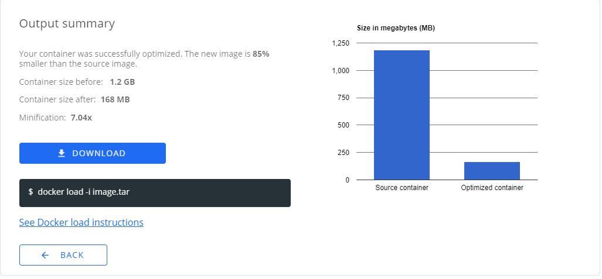

# Slim Starter Pack: Node.js
[LINK TO SLIMAI](https://portal.slim.dev/home/profile/dockerhub%3A%2F%2Fdockerhub.public%2Flibrary%2Fnode%3Alatest)
[LINK TO IMAGE ON DOCKERHUB](https://hub.docker.com/_/node)

Attention Node.js develeopers! 

Optimize and harden your containerized applications the easy way — with Slim.AI. 

This Starter Kit will help you proactively remove vulnerabilities from your applications. 

Simply replace the application code here with your own application, run it through Slim.AI's [automated container optimization](https://www.slim.ai/docs/optimization) process, and you'll remove up to 90% of the image's vulnerabilities. 

No more chasing down hard to patch vulns that your application isn't even using. 

# Optimization Results


## Overall results


Slimming this Node.js container results in a 85% reduction in attack surface with 0 new code!


# Get Started
To start this dockerized Node.js application, all you will need is a running Docker daemon. From there, running your this app requires just two simple commands executed in the app directory.
  
```bash
  docker build -t node-website .
  docker run -dp 8080:8080 node-website
```

From there, all you need to do is navigate to localhost:8080 on your host machine. 

## Sample Application
Our sample application is a self-hosted version of the official Node Js website. You can find the code [here](https://github.com/nodejs/nodejs.org).


Replace this placholder code with your own application code and install any necessary dependencies to create your own slimmable container. 

## Sample Dockerfile
Our Dockerfile builds off of the `node:16` base image.
  
  ```Dockerfile
  FROM node:16

  WORKDIR /usr/src/app

  COPY package*.json ./

  RUN npm install

  COPY . .

  EXPOSE 8080
  CMD [ "node", "server.js" ]
  ```
