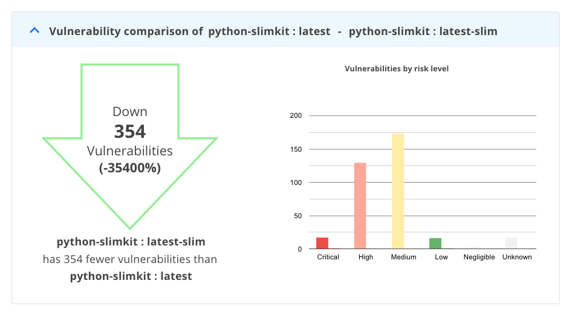
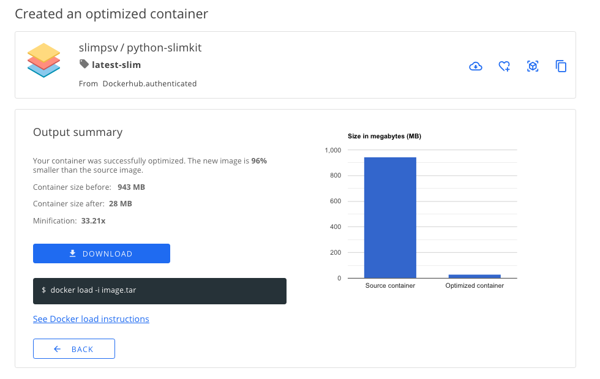

# Slim Starter Pack: Python 'Hello World'
[](https://www.slim.ai/)
[](https://hub.docker.com/)

Hello Python develeopers! 

Optimize and harden your containerized applications the easy way — with Slim.AI. 

This Starter Kit will help you proactively remove vulnerabilities from your applications. 

Simply replace the application code here with your own application, run it through Slim.AI's [automated container optimization](https://www.slim.ai/docs/optimization) process, and you'll remove up to 90-percent of the image's vulnerabilities while also making it up to 30X smaller. 

No more chasing down hard to patch vulns that your application isn't even using, and you can use any base image you want — even `python:latest`. 

# Optimization Results


Slimming this Python container results in 100-percent reduction in overall vulnerabilities. 

## Vulnerability difference by severity 

[See the full report.](https://www.slim.ai/starter-kits/python)

# Get Started
To start a Python application application, you'll need the following libraries installed locally, or running in a dev environment link GitPod, Docker Environments, or Code Spaces. 


``` 
# requirements.txt
Flask=2.2.1
```

## Sample Application
Our sample application is a simple REST API that merely returns "Hello World!".

While this app is simple, it's a great starting point for more complex development. 

Project structure
```
Dockerfile
|- app
|-- app.py
|-- requirements.txt
|- tests
|-- test.py

```

Code sample
``` python 
@app.route("/")
def hello():
    return jsonify({"msg": "Hello, World!"})
```

Replace this placholder code with your own application code, and install any necessary dependencies, to create your own slimmable container. 

## Sample Dockerfile
Our Dockerfile builds off of the `python:latest` image and starts at **943 MB**. The slimming process reduces the size by **33X** to just **28 MB**. 



[See the full report on Slim.AI](https://portal.slim.dev/... )
