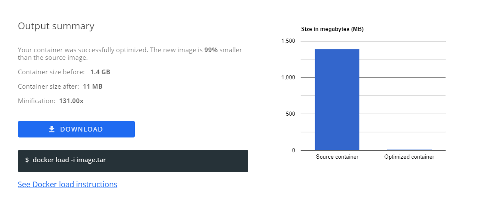
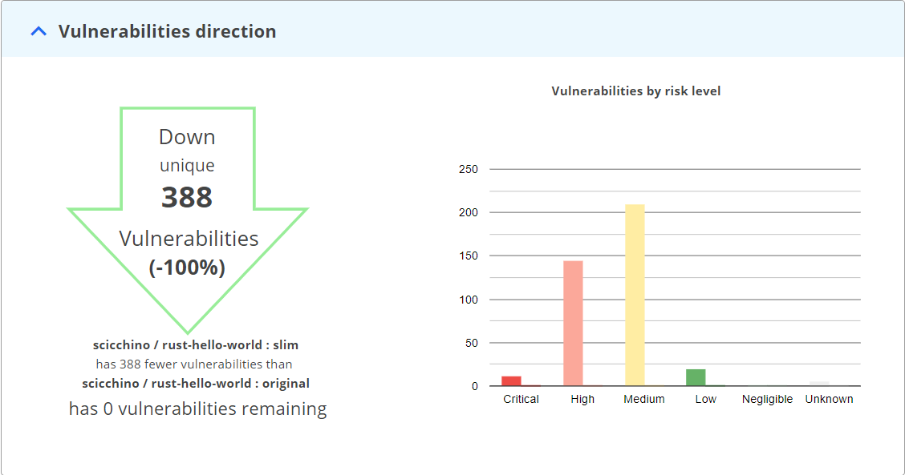

# Slim Starter Pack: Rust
[LINK TO SLIMAI](https://portal.slim.dev/home/profile/dockerhub%3A%2F%2Fdockerhub.public%2Flibrary%2Frust%3Alatest)
[LINK TO IMAGE ON DOCKERHUB](https://hub.docker.com/_/rust)

Attention Rust developers! 

Optimize and harden your containerized applications the easy way — with Slim.AI. 

This Starter Kit will help you proactively remove vulnerabilities from your applications. 

Simply replace the application code here with your own application, run it through Slim.AI's [automated container optimization](https://www.slim.ai/docs/optimization) process, and you'll remove up to 90% of the image's vulnerabilities. 

No more chasing down hard to patch vulns that your application isn't even using. 


## Overall results


Slimming this Rust container results in a **100**% reduction in overall vulnerabilities. 

## Vulnerability difference by severity 



# Get Started
To start this Rust application, all you need is to clone this repository in an environment with a running Docker daemon, navigate to the app folder and use these two commands to run the server.

```console
docker build -t rust-hello-world:original .
docker run -p 7878:7878 rust-hello-world:original
```

To slim this application - or your own-, all you need to do is push the container image to your preferred registry, log into the Slim portal, select the image, and hit optimize! The only additional flag required on this container’s optimize is an “include” selection on the asset folder.

## Sample Application
Our sample application is a simple Rust “Hello World” webserver built using standard Rust libraries.. 

Check out the app code in the app folder of this repository!

If you want to try this process on your own Rust app, replace this placholder code with your own application code, and apply the same process!

## Sample Dockerfile
Our Dockerfile builds off of the `Rust:latest` image to create the web server.

```Dockerfile
FROM rust:latest 

COPY ./ ./ 

RUN cargo build --release 

EXPOSE 7878 CMD ["./target/release/slim-cloud-native-webserver"]
```
