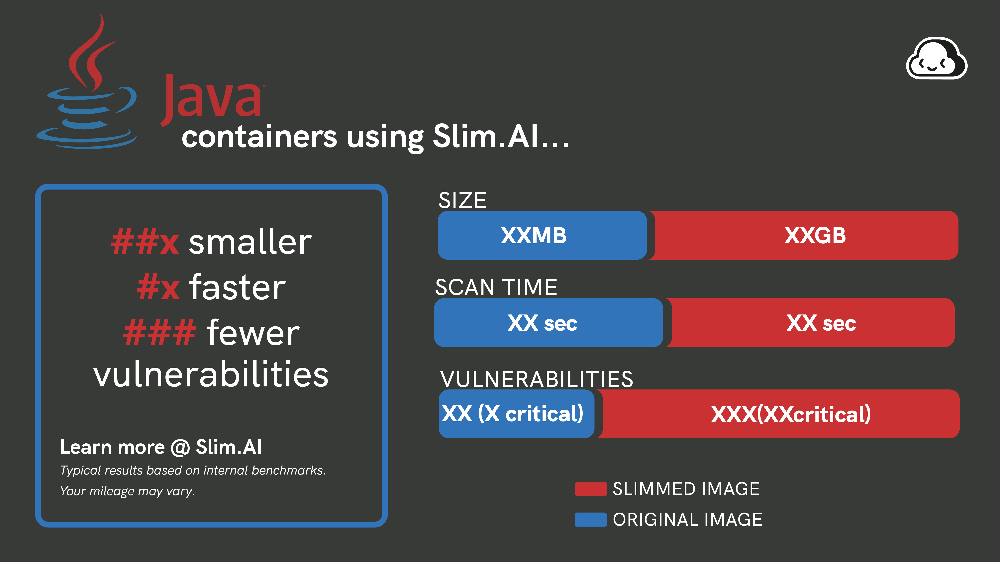

# Slim Starter Pack: <Framework>
[LINK TO SLIMAI]
[LINK TO IMAGE ON DOCKERHUB]

Attention <Framework> develeopers! 

Optimize and harden your containerized applications the easy way — with Slim.AI. 

This Starter Kit will help you proactively remove vulnerabilities from your applications. 

Simply replace the application code here with your own application, run it through Slim.AI's [automated container optimization](https://www.slim.ai/docs/optimization) process, and you'll remove up to 90% of the image's vulnerabilities. 

No more chasing down hard to patch vulns that your application isn't even using. 

# Optimization Results
## Overall results


Slimming this <Framework container> re

## Vulnerability difference by severity 

[See the full report.](https://www.slim.ai/starter-kits/<framework>)

# Get Started
To start a <Framework> application, you'll need the following libraries installed locally, or running in a dev environment link GitPod, Docker Environments, or Code Spaces. 

``` 
list of tools / dependencies
```

## Sample Application
Our sample application is a simple (REST API / TODO list app). 

```
app folder structure
```

```
app code
```

Replace this placholder code with your own application code, and install any necessary dependencies, to create your own slimmable container. 

## Sample Dockerfile
Our Dockerfile builds off of the `<framework>:latest` image to create a fully functional

## Sample Tests

## GitHub Action
