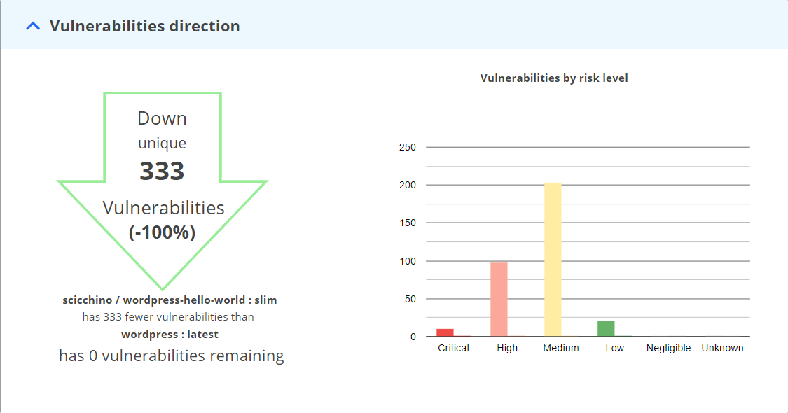
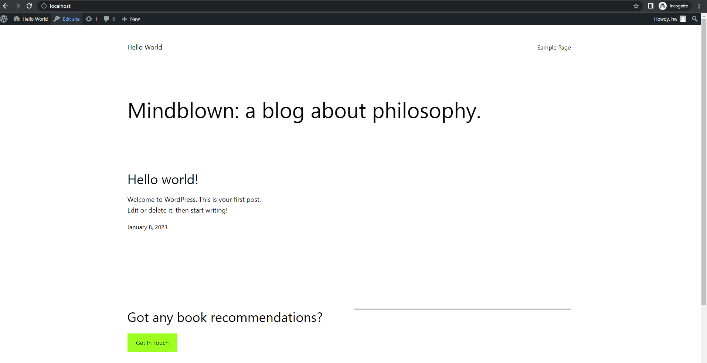

# Slim Starter Pack: Wordpress
[LINK TO SLIMAI](https://portal.slim.dev/home/xray/dockerhub%3A%2F%2Fdockerhub.public%2Flibrary%2Fwordpress%3Alatest#explorer)
[LINK TO IMAGE ON DOCKERHUB](https://hub.docker.com/_/wordpress)

Attention Wordpress developers! 

Optimize and harden your containerized applications the easy way — with Slim.AI. 

This Starter Kit will help you proactively remove vulnerabilities from your applications. 

Simply replace the application code here with your own application, run it through Slim.AI's [automated container optimization](https://www.slim.ai/docs/quickstart) process, and you'll remove up to 90% of the image's vulnerabilities. 

Because this Wordpress application relies on a database, we require a few extra steps.

You can see in the docker-compose.yaml file that we write to volumes for both Wordpress and the DB. These volumes won't be created or interacted with by the slim tools that monitor the container. 
For this reason, its important to use a second Docker Compose file that excludes these volumes. (If you run in the Slim Cloud, they wouldn't even be accessible anyway!)
You can see the change in the included docker-compose-dev.yaml.

In the setup wizard, be sure to select "/run/lock" when it prompts you for files to manually include - this is critical to the server startup. You should also be sure to upload the volume-free compose file and target the Wordpress service for correct results.

No more chasing down hard to patch vulns that your application isn't even using. 

# Optimization Results

## Overall results


Slimming this example Wordpress container results in a new container about 1/3 the size of the original! Nearly 400 MB of unnecessary files were removed.

## Vulnerability difference by severity 



In the process, we have eliminated all of our detected vulnerabilities!

# Get Started

To try this for yourself, you can use the regular docker-compose.yaml file. go to localhost:80, and use the Wordpress setup wizard to create a basic wordpress site!



## Sample Docker Compose
Our original Dockerfile builds off of the latest Wordpress image to create the pre-hardened app.

```yaml
version: '3.7'

services:
  wordpress:
    image: wordpress:latest
    links:
     - mariadb:mysql
    environment:
     - WORDPRESS_DB_PASSWORD=password
     - WORDPRESS_DB_USER=root
    ports:
     - 80:80
    volumes:
     - ./html:/var/www/html
  mariadb:
    image: mariadb:latest
    environment:
     - MYSQL_ROOT_PASSWORD=password
     - MYSQL_DATABASE=wordpress
    volumes:
     - ./database:/var/lib/mysql
```

From there, it's a simple command to run the app and check out the webpage!

```bash
docker-compose up -d
```

Just visit localhost:80 to see for yourself. To view the slimmed version of the site and verify functionality, just replace wordpress:latest with your own slimmed wordpress image or use the docker-compose-slim.yaml with the -f flag!

```bash
docker-compose -f docker-compose-slim.yaml up -d
```
